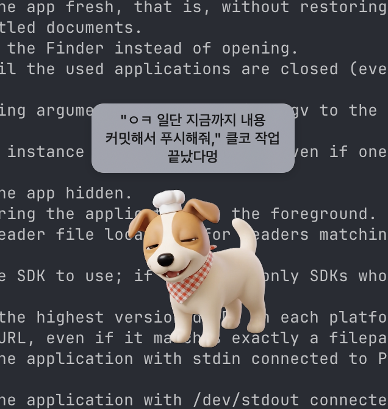

# PuppyPet 🐶

macOS 메뉴바 위에서 함께 일하는 데스크탑 펫. 작업 중 휴식을 챙겨주고, 캘린더 일정과 Claude Code 작업 흐름까지 옆에서 알려줍니다.

<p align="center">
  
</p>

## 기능

- **메뉴바 펫** — 알파 채널 영상으로 움직이는 강아지, 자유롭게 드래그 (메뉴바·Dock 위도 OK)
- **클릭 → 멍!** — 강아지를 누르면 랜덤 한 줄 멘트 말풍선
- **작업 리마인더** — 일정 시간 단위로 휴식·스트레칭 알림 말풍선
- **Google Calendar 연동** — 일정 10분 전 자동 말풍선, 토큰 만료 시 자동 해제 + 안내
- **Claude Code 워처** — `~/.claude/projects/**/*.jsonl`을 감시해
  - 진행 중일 때 💭 표시
  - 턴 끝나면 _"…클코 작업 끝났다멍"_ 말풍선 → 탭하면 마지막 응답 본문 팝오버

## 설치 (DMG)

[Releases](../../releases) 페이지에서 최신 `PuppyPet.dmg`를 받습니다.

1. DMG를 더블클릭해서 마운트
2. `puppy.app`을 `Applications` 폴더로 드래그
3. 첫 실행 시 _"확인되지 않은 개발자"_ 경고가 뜨면 한 번만 우회:
   - **우클릭 → 열기**, 또는
   - **시스템 설정 → 개인정보 보호 및 보안** 하단의 _"열기 허용"_ 버튼, 또는
   - 터미널에서: `xattr -dr com.apple.quarantine /Applications/puppy.app`

(미서명·미공증 빌드이기 때문에 필요한 단계입니다.)

## 셋업 (소스에서 빌드)

요구사항: macOS 15.6+, Xcode 16+

```bash
open puppy.xcodeproj
```

Xcode에서 빌드(`⌘R`)하면 메뉴바 우측에 강아지가 뜹니다.

로컬에서 DMG를 직접 만들고 싶다면:

```bash
./scripts/build_dmg.sh
# → build/PuppyPet.dmg
```

### Google Calendar (선택)

연동하려면 강아지 **우클릭 → "Google 캘린더 연결"**.
ASWebAuthenticationSession + PKCE 플로우로 로그인하며, 토큰은 Keychain에 저장됩니다.

> 자체 OAuth 클라이언트를 쓰려면 `puppy/Services/GoogleAuth.swift`의 `clientID` / `urlScheme`을 본인 값으로 교체하고, Info.plist의 URL Scheme도 동일하게 등록하세요. 스코프는 `calendar.events.readonly`.

## 강아지 영상은 어떻게 만들었나요

`puppy_alpha.mov`(메뉴바에서 움직이는 강아지) 제작 파이프라인입니다.

1. **컨셉 잡기** — ChatGPT에 캐리커처·크레파스 화풍 등으로 "내가 원하는 강아지"의 핵심 특징(견종, 표정, 액세서리 등)을 뽑아달라고 요청
2. **레퍼런스 이미지 1장** — 위 특징 설명을 Nano Banana(Gemini 이미지 생성)에 넣어 기준 이미지 한 장 생성
3. **캐릭터 보드** — 그 기준 이미지를 다시 입력으로 주고 *"같은 캐릭터, 여러 표정/포즈"* 시트(캐릭터 보드)를 생성
4. **앵글별 컷** — 캐릭터 보드를 참조로 정면·측면·뒤·기울임 등 뷰포인트별 이미지를 따로 뽑음
5. **영상화** — 위 컷들을 Kling(영상 생성 모델)에 넣어 짧은 루프 영상으로 변환
6. **알파 처리** — `scripts/process_alpha.swift`로 Vision의 인물(피사체) 분리를 돌려 배경 제거 → `puppy_alpha.mov` 산출

각 단계에서 다음 단계가 "캐릭터 일관성"을 잃지 않도록, **이전 단계 산출물을 그대로 다음 모델의 레퍼런스로 넘기는 게** 포인트입니다.

## 프로젝트 구조

```
puppy/
├── puppyApp.swift          # @main, AppDelegate, 서비스 와이어링
├── MenuBar/                # NSStatusItem 컨트롤러
├── Window/                 # PetPanel (NSPanel) + 컨트롤러
├── Views/                  # PetView, SpeechBubbleView, 영상/스프라이트 뷰
├── Services/
│   ├── WorkTimer.swift         # 작업 시간 추적
│   ├── ReminderEngine.swift    # 휴식 리마인더
│   ├── GoogleAuth.swift        # OAuth (PKCE)
│   ├── CalendarService.swift   # Google Calendar API
│   ├── CalendarReminder.swift  # 일정 10분 전 알림
│   └── TranscriptWatcher.swift # Claude Code jsonl 감시
├── Storage/                # Keychain·UserDefaults 헬퍼
└── Resources/              # 영상·스프라이트·메시지 풀
```
